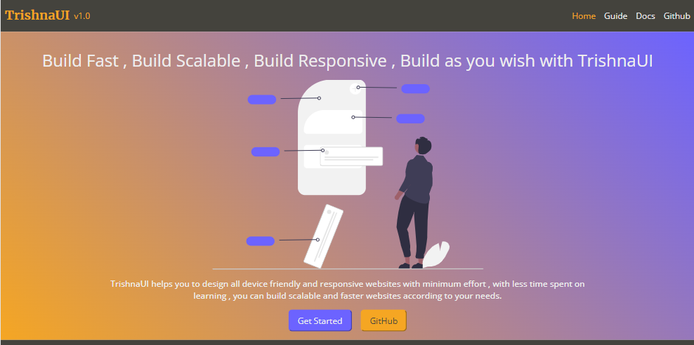
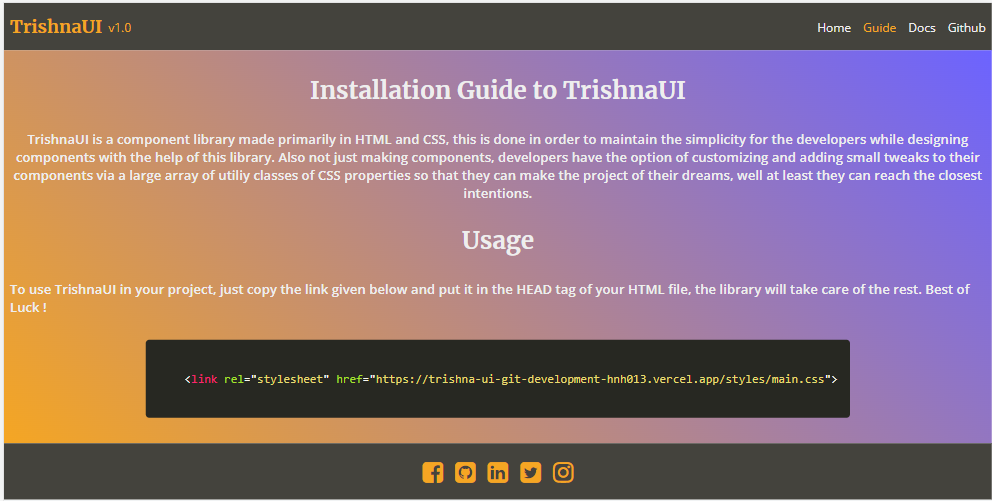
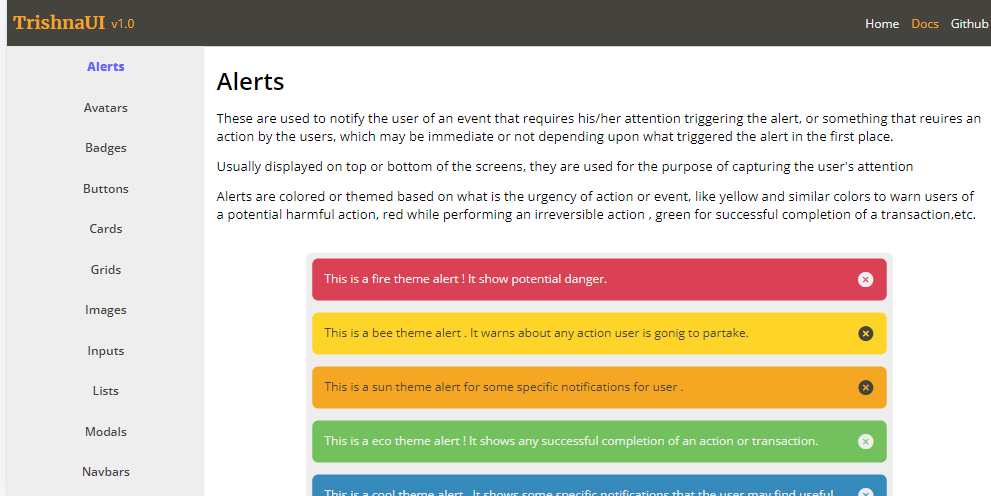

# TrishnaUI<a name="top"></a>

#### Live Project Link : https://trishna-ui-git-development-hnh013.vercel.app/
#### Live CDN Link : https://trishna-ui-git-development-hnh013.vercel.app/styles/main.css

## Contents

1. **[Project Title & description](#trishnaUI)**
2. **[Purpose of the project](#purpose-of-the-project)**
3. **[Technologies Used](#technologies-used)**
4. **[Motivations behind the project](#motivations-behind-the-project)**
5. **[Problems solved by the project](#problems-solved-by-the-project)**
6. **[Learning from the project](#learning-from-the-project)** 
7. **[Challenges and future iterations](#challenges-and-future-iterations)**
8. **[Demo](#demo)**
9. **[Usage & Installation](#usage-and-installation)**
10. **[Local Setup and running in Local](#local-setup-and-running-in-local)**

## 1. TrishnaUI<a name="trishnaUI"></a>
* TrishnaUI is a component Library that gives the devlopers to build websites for the internet by using pre-made components, so that they can build faster and efficiently. 
* The library offers a good number of such components with a large variety of components available as per the needs of the developer, theme or the type of website. 
* The library's list of componets however is not limited and will be adding more in the upcoming future. 

The current list of components and utilities offered by the library are :
  
1. Alerts
2. Buttons
3. Avatars
4. Badges
5. Cards 
6. Grids
7. Images
8. Inputs
9. Lists
10. Modals
11. Navbars
12. Ratings
13. Toasts
14. Flexbox
15. Colors
16. Typography

## 2. Purpose of the project<a name="purpose-of-the-project"></a>

The application provides developers to use a number of pre made components for web application , by addition of a CDN link, and make them able to customize those
components with a wide variety of utility classes made available by the library.

## 3. Technologies Used<a name="technologies-used"></a>
* The technologies used (HTML, CSS and vanilla JS) are basic and come with little to no dependencies in form of libraries and imports.
* These can be heavily manipulated or customized to build components as per the wish, with almost every component build from scratch. 

## 4. Motivations behind the project<a name="motivations-behind-the-project"></a>

* This project was built as part of my learning of HTML and CSS in neogcamp 2022 . It also serves as proof of concept, as being in vanilla css and vanilla JS
* The motivation behind making TrishnaUI was to make static reusable components that can be used to develop a wide ariety of web applications that can serve a whole lot of purposes, while coming from a same continuity, or basic pattern.  
* It does not uses any additional CSS or JS libraries , dependencies (exception being font family and icons) and higher JS or CSS frameworks  and is made from scratch, for every component in the library.

## 5. Problems solved by the project<a name="problems-solved-by-the-project"></a>

* The project/component library aims to solves or tries to mitigate the problem of making components while developing a web application in a faster, simpler and easier way
* Giving developers chance in customizing looks of components with a wide array of utility class avialable at their expense.

## 6. Learning from the project<a name="learning-from-the-project"></a>

* While making the component library I learnt the basic and various intermediate and advanced concepts of HTML , CSS and JS 
* I also went through official documentation and practical use cases so they can best serve the purpose.

## 7. Challenges and future iterations<a name="challenges-and-future-iterations"></a>

* One of the biggest challenges was to have to integrate a large number of colors because of theme feature adn day/night , light/dark mode that modern websites offer to their users, that is still in progress.
* Customizaiton is still being planned so as to give developers the chance to being able to add their custom styles or modify existing ones to serve their needs.
* Increasing the number of components available in the library is a top priority task out of all.

## 8. Demo<a name="demo"></a>
Following are some snapshots of the project 

#### Home Page


#### Usage Guide Page


#### A component Page


## 9. Usage and Installation<a name="usage-and-installation"></a>
* To use the library no installation is required. People just need to copy the link of CDn in the head tag of their HTML files.

```

Put the link inside <head> tag to get started!
<link rel="stylesheet" href="https://trishna-ui-git-development-hnh013.vercel.app/styles/main.css">

```


## 10. Local setup and running in local<a name="local-setup-and-running-in-local"></a>

* The app is made in HTML , vanilla CSS and vanilla JS so there is no need to install the dependencies
Pre-requisites : A code editor
Steps to run the app at your local machine

1. Run the command on CLI/command prompt to clone the repo on your local machine in the directory of your choice
` git clone https://github.com/Hnh013/TrishnaUI.git `
2. Take the latest pull by typing following command on CLI/command prompt
` git pull origin development `
3. Go to the file explorer and simply right click on the index.html file , and click on Open with Chrome. The app will open.
4. Alternative way is with Visual Studio Code , download the live server extension , and after taking clone and latest pull of the repo , right click on anywhere in index.html and click on run llive server . App will open automatically on default browser.

Also I would love to know about your experience, please send your feedbacks, criticisms and suggestions regarding this app at my mail - najay357@gmail.com

[Back To Top](#top)